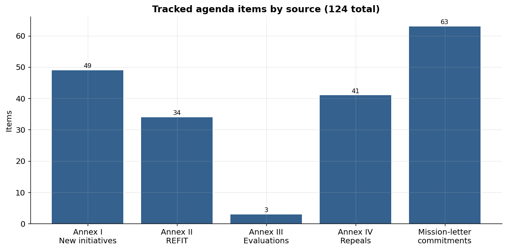
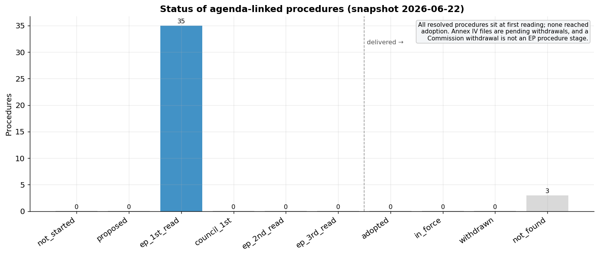
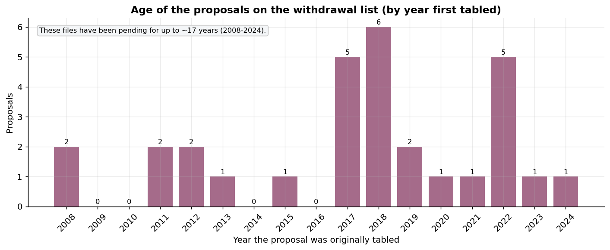
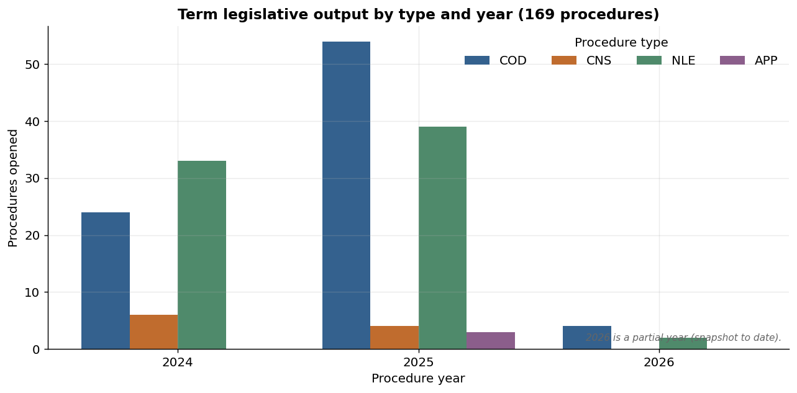
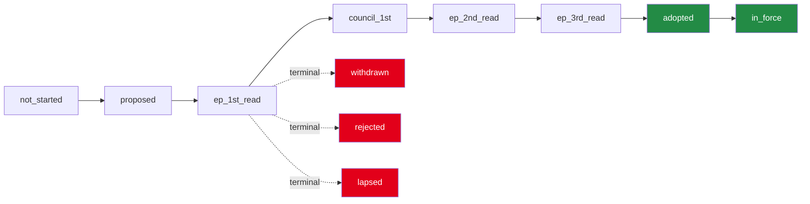
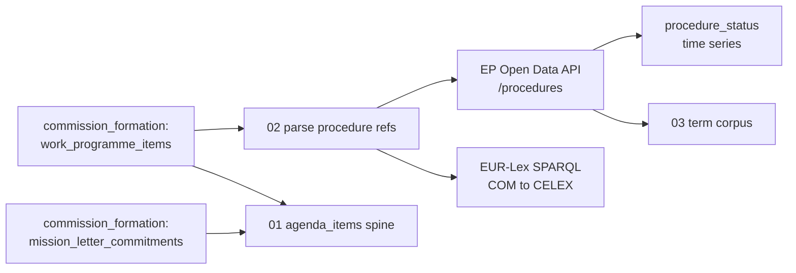

# Agenda Implementation: Data Summary

A visual tour of how far the 2024-2029 von der Leyen II Commission has
implemented the legislative agenda it set itself. The dataset links each planned
agenda item to its real legislative fate, resolved against the EP Open Data API
and cross-checked in EUR-Lex. All figures are reproducible from the output CSVs
(see *Reproducing*), and reflect the **latest snapshot** in the time series.

---

## What is being tracked



- **190 agenda items** are tracked: the 127 CWP 2025 work-programme items (across
  the four annexes) plus the 63 legislative mission-letter commitments.
- The scopes differ sharply in how automatable they are. Only **Annex IV**
  (whose proposals carry procedure numbers) resolves automatically; Annex I new
  initiatives, the evaluations and the commitments are curated, because policy
  brand names do not reliably match formal EP procedure titles. This split is the
  reason the dataset is built in phases, and this release ships Phase 1.

## Implementation status



This is the core measure - and it carries an honest, easily-misread signal:

- The 38 agenda-linked procedures (all Annex IV) resolve to **35 at
  first reading and 3 not found**, with **none adopted or in force**.
- That is *expected*, not a failure of the data: Annex IV items are old proposals
  the Commission **plans to withdraw**. The EP API reports an EP procedure stage,
  and a Commission withdrawal is not an EP stage, so these files sit formally
  pending at first reading. The dataset records this faithfully; confirming the
  actual withdrawals is a future EUR-Lex-based check.

## How old the withdrawal list is



Plotting each proposal by the year it was first tabled shows **why these files
are being cleared**: they reach back to **2008**, with clusters around 2017-2018
and 2022. Many have been formally pending for over a decade, which is the
clean-up rationale behind Annex IV.

## The legislative backdrop



The baseline corpus catalogues every COD/CNS/NLE/APP procedure opened in
2024-2026 (the denominator for "planned agenda vs total activity"). Ordinary
legislative procedures (COD) and non-legislative procedures (NLE) dominate the
term's output; only a small fraction are referenced by the CWP agenda, which is
itself mostly backward-looking clean-up rather than new files.

---

## The status ladder



`delivered = status in {adopted, in_force}`. Annex IV items are expected to end
at `withdrawn`, but that is a Commission act the EP API does not record, so they
currently read `ep_1st_read`.

## How the dataset is assembled



## Reproducing

```bash
python run_pipeline.py        # rebuild data/output/*.csv (network steps cache to data/raw)
python make_summary.py        # regenerate figures/*.png from the CSVs
```

Figures use the latest `as_of_date` snapshot and are otherwise deterministic.
Statistics shared with README.md are checked against the CSVs by
`verify_readme.py`; the remaining figures were verified against the CSVs when
this summary was generated (snapshot 2026-06-22).
