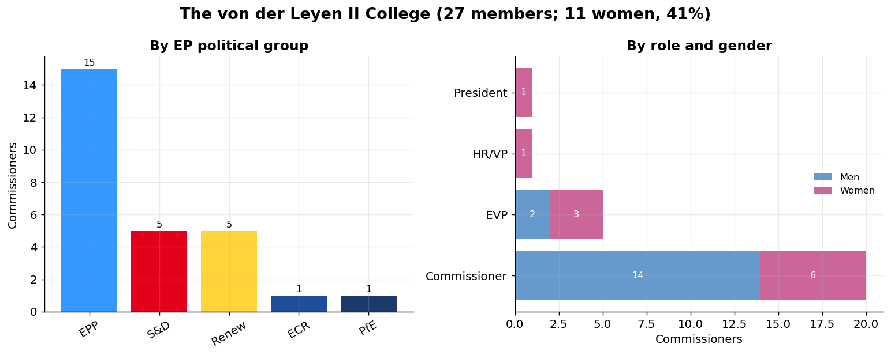
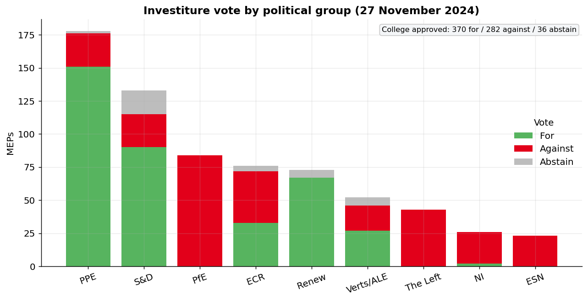
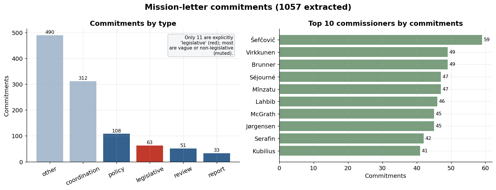
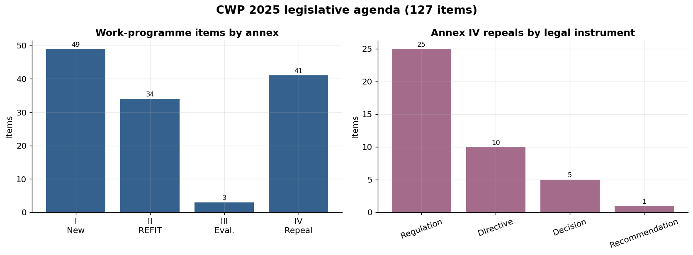
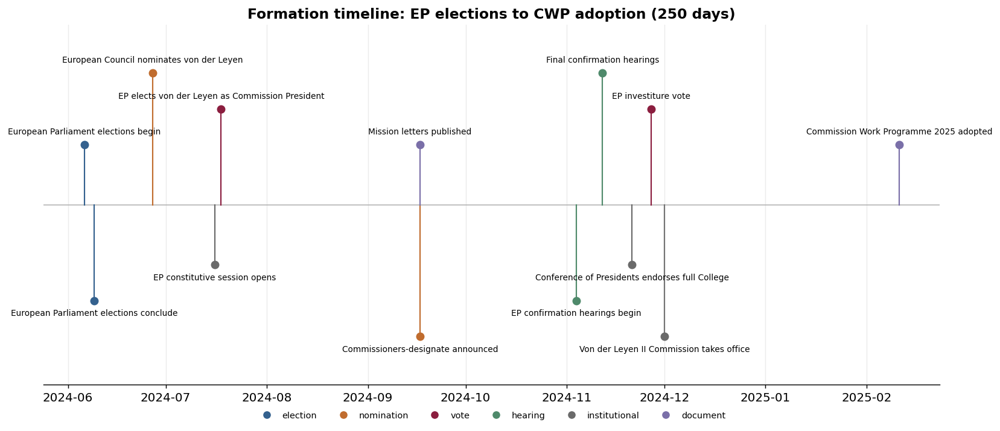
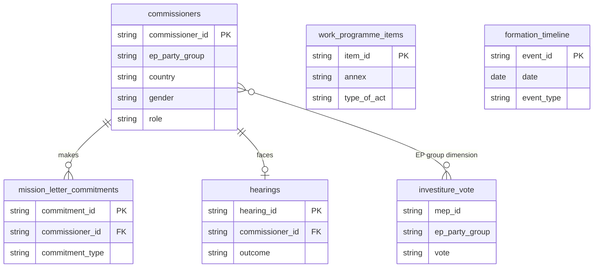

# Commission Formation: Data Summary

A visual tour of the 2024-2029 von der Leyen II Commission formation dataset:
who the College is, how Parliament voted it in, what it promised, and the agenda
it set. All figures are reproducible from the output CSVs (see *Reproducing*).

---

## The College



- The College of **27** is dominated by the **EPP (15 members, 56%)**; the
  remaining seats are split across S&D, Renew, ECR and PfE, mirroring the
  parties that nominated each national commissioner.
- It is **41% women (11 of 27)**, but the role-and-gender split reveals a sharper
  pattern than the headline: women hold the **Presidency, the High
  Representative role and 3 of the 5 Executive Vice-Presidencies**, yet only **6
  of 20** rank-and-file Commissioner posts. The gender story sits in seniority,
  not headcount.

## How Parliament voted it in



- The College was approved **370 for / 282 against / 36 abstain** on 27 November
  2024 - a comfortable majority but a notably thin one by historical standards.
- The figure exposes the **centrist coalition**: the EPP (85% in favour), S&D and
  Renew (67 of 73 for) carried the vote, while **PfE and ECR voted overwhelmingly
  against** and the Left and Greens largely withheld support.
- Support is visibly *grouped*, not national: the stacked bars show cohesion
  within political groups rather than within country delegations.

## What the College promised



- **1057 commitments** were extracted from the 26 mission letters and typed by an
  LLM classifier (Claude Sonnet 4.6) reading each in full. The modal type is
  vague (`other` 490, `coordination` 312); only **63 are explicitly
  `legislative`** - a caveat that directly motivates the agenda-implementation
  dataset, which can only track that legislative subset.
- Commitment counts vary widely by portfolio (31 to 59), with the broad
  cross-cutting briefs (e.g. the Vice-Presidents) carrying the most.

## The legislative agenda it set



- The 2025 Commission Work Programme contains **127 items**: 49 new initiatives
  (Annex I), 34 REFIT evaluations (II), 3 interim evaluations (III) and **41
  repeals/withdrawals (IV)** of obsolete proposals.
- Of the 49 new initiatives, only **17 are legislative**; the rest are strategies,
  communications and action plans - a notably non-legislative agenda.
- Annex IV is dominated by **regulations and directives**, reflecting a
  housekeeping drive to clear long-stalled files - the very items the
  agenda-implementation dataset tracks.

## How it came together



- From the June 2024 elections to CWP adoption spans **250 days**, with the
  institutional crunch (hearings, Conference of Presidents, investiture vote,
  taking office) compressed into November 2024.

---

## Table relationships



`work_programme_items` and `formation_timeline` are standalone tables; the EPP /
PPE label differs between `commissioners` and `investiture_vote` (harmonise
before joining - see CODEBOOK).

## Reproducing

```bash
python run_pipeline.py        # regenerate data/output/*.csv
python make_summary.py        # regenerate figures/*.png from the CSVs
```

Figures are deterministic (no random state, fixed ordering). Statistics quoted
above are checked against the CSVs by `verify_readme.py`.
