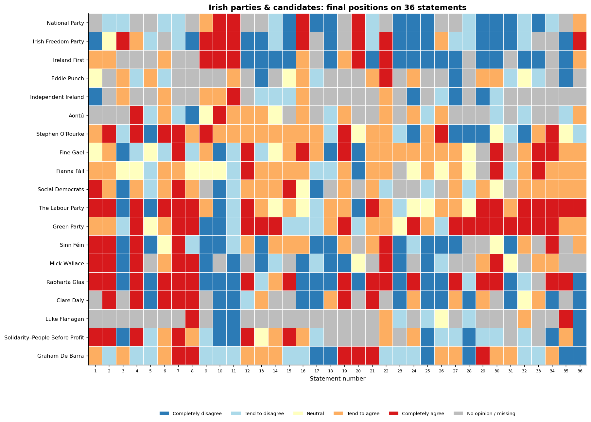
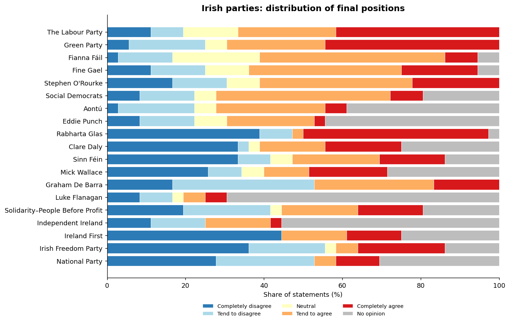
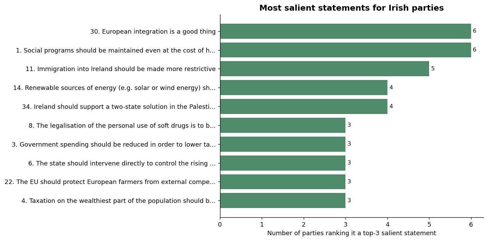
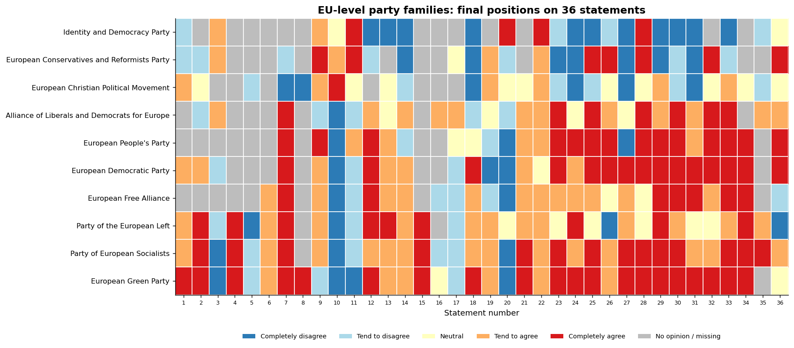
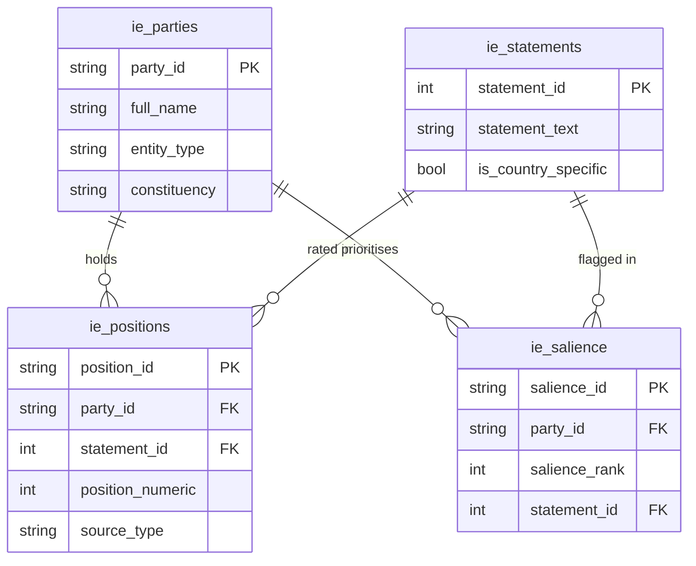

# euandi 2024: Data Summary

A visual tour of the euandi (EU&I) 2024 Voting Advice Application coding for the
June 2024 European Parliament election: where Irish parties and candidates, and
the EU-level party families, placed themselves on 36 policy statements. All
figures are reproducible from the output CSVs (see *Reproducing*).

The coding is a 5-point scale - **completely disagree (-2) to completely agree
(+2)**, plus an explicit *No opinion* - and this summary uses the **final
(calibrated) placement** only.

---

## The position matrix (Ireland)



This is the heart of the dataset: every Irish party and candidate (rows) against
every statement (columns), coloured by position.

- **Rows are ordered by similarity** (hierarchical clustering), so blocs read as
  contiguous bands: the **nationalist right** (National Party, Irish Freedom
  Party, Ireland First) sits at the top, the **radical left** (Rabharta Glas,
  Solidarity-People Before Profit, Clare Daly, Sinn Féin) at the bottom, with
  Fianna Fáil and Fine Gael in the centre. The immigration and EU items
  (statements 9 and 11, and the right-hand columns) flip cleanly between the
  two ends.
- **Independent candidates are sparser** (more grey): several declined to take a
  position on many statements, so their rows carry more *No opinion / missing*.
- Overall **79% of Irish placements are substantive** (a position rather than
  *No opinion*).

## Who agrees with what



Ordered by net agreement (most-agreeing at the top), the stacked bars summarise
each party's overall lean and its coverage:

- The Labour Party and the Green Party sit at the agreeable end; the National
  Party, Irish Freedom Party and Ireland First at the disagreeing end.
- The grey tails quantify **non-response**: some smaller parties and independents
  left a third or more of statements at *No opinion*, which matters for any
  downstream similarity scoring.

## Which issues parties prioritised



Each party flags its three most salient statements. Aggregating those picks
shows the **issues Irish parties chose to foreground**: social spending,
European integration, and immigration top the list - the fault lines of the 2024
campaign.

## The EU-level party families



The same statement battery coded for the 10 EU-level party families (EPP, PES,
ALDE, EGP, ECR, ID, and others). Read top-to-bottom, the families separate
into recognisable blocs, giving a European backdrop against which the national
Irish positions can be compared (note the wording is country-templated, so join
on `statement_id` with care - see CODEBOOK).

---

## Table relationships



The `eu_*` tables share this schema. Ireland and EU-level are parallel datasets;
`statement_id` is shared by number, and the wording is identical for 32 of the
36 statements (only the country-templated ids 11, 15, 34 and 36 differ).

## Reproducing

```bash
python run_pipeline.py        # regenerate data/output/*.csv from the workbooks
python make_summary.py        # regenerate figures/*.png from the CSVs
```

Figures are deterministic. Statistics quoted above are checked against the CSVs
by `verify_readme.py`.
